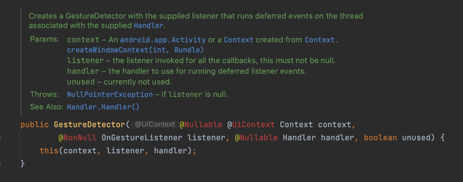
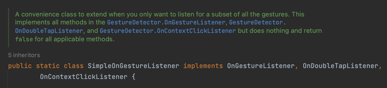

# BeomTube

- 유튜브 비슷하게 만들어보기
- ExoPlayer, MotionLayout, Touch

## [ExoPlayer](https://developer.android.com/guide/topics/media/exoplayer?hl=ko)

- [github](https://github.com/google/exoplayer)
- Android의 하위 수준 미디어 API를 토대로 개발된 앱 수준의 미디어 플레이어
- Android 프레임워크는 아니나, Google에서 별도로 배포하는 오픈소스 프로젝트
- ExoPlauer는 맞춤설정이나 확장성이 매우 높아 다양한 사례를 지원하고, YouTube 및 Google Play Movie / TV 등의 Google 앱에서 사용

## Touch

[Touch 관련 글](https://github.com/YiBeomSeok/TIL/blob/965251edfe5d3a18786ebc5df23867a1d71816ea/Android/ViewGroup%EC%97%90%EC%84%9C%20%ED%84%B0%EC%B9%98%20%EC%9D%B4%EB%B2%A4%ED%8A%B8%20%EA%B4%80%EB%A6%AC.md)

### onSwipe

- `onSwipe`는 `MotionLayout`에 대한 사용자의 스와이프 동작에 반응하여 애니메이션을 제어하는 방법을 제공한다.
- 이는 `MotionScene`(애니메이션 및 전환을 정의하는 XML 파일, 이 프로젝트에서는 `player_scene`으로 작성됨) 내부에 있는 `<Transition>` 요소
  안에 있는 `<OnSwipe>` 요소로 정의된다.

이 때 `<OnSwipe>`에 `touchAnchorId` 속성을 통해 스와이프 동작이 시작되는 뷰의 ID를 지정해줄 수 있다.

```xml

<OnSwipe motion:touchAnchorId="@id/videoPlayerContainer" />
```

#### Touch, Gesture 가 전달되지 않는 경우

- `motion:touchAnchorId="@id/videoPlayerContainer"` 속성을 주고 있지만, videoPlayerContainer에 터치 이벤트가 전달되지
  않는 상황이 발생할 수 있다.
- 이러한 경우 `MotionLayout`에 제스쳐를 전달하기 위해 커스텀 뷰를 작성하여 해결할 수 있는데, 이 때 두 가지를 필요로 한다.
    - `onInterceptTouchEvent` 오버라이드: `MotionLayout`으로 전달된 TouchEvent를 가로챌 필요가 있다. 즉, 만일 원하는 터치 이벤트일
      경우, 더 깊은 뷰로 이벤트를 전달하지 않는 것이다.
    - `GestureDetector`: 스와이프로 원하는 제스처가 스크롤이기 때문에, 해당 이벤트가 스크롤인지 판별할 객체가 필요하다.



- `GestureDetector`는 초기화 시에 `context`와 `OnGestureListener`를 필요로 하기 때문에 `OnGestureListener` 인터페이스를
  구현하여 인자로 넣어주어야 한다.



- 여기에서는 `OnGestureListener`의 모든 함수를 구현하는 것 보다는, 스크롤을 통해 `MotionLayout`을 `collapse`상태로 변화시켜줄 필요만 있기
  때문에 `OnGestureListener`를 상속받는 `SimpleOnGestureListener`를 넣어줄 수 있다.(`SimpleOnGestureListener`는
  인터페이스가 아닌 클래스이기 때문에 필요한 함수만 오버라이드가 가능하다.)

#### CustomView

이제 `GestureDetector`로부터 전달받은 이벤트가 스크롤인지 확인되었을 때, 터치 이벤트를 가로챌 수 있도록 할 수 있다.

```kotlin
class ExoPlayerMotionLayout @JvmOverloads constructor(
    context: Context,
    attributeSet: AttributeSet? = null,
    defStyleAttr: Int = 0
) : MotionLayout(context, attributeSet, defStyleAttr) {

    var targetView: View? = null

    private val gestureDetector by lazy {
        GestureDetector(context, object : GestureDetector.SimpleOnGestureListener() {
            override fun onScroll(
                e1: MotionEvent,
                e2: MotionEvent,
                distanceX: Float,
                distanceY: Float
            ): Boolean {
                return targetView?.containTouchArea(e1.x.toInt(), e1.y.toInt()) ?: false
            }
        })
    }

    override fun onInterceptTouchEvent(event: MotionEvent?): Boolean {
        event?.let {
            return gestureDetector.onTouchEvent(event)
        } ?: return false
    }

    private fun View.containTouchArea(x: Int, y: Int): Boolean {
        return (x in this.left..this.right && y in this.top..this.bottom)
    }
}
```
